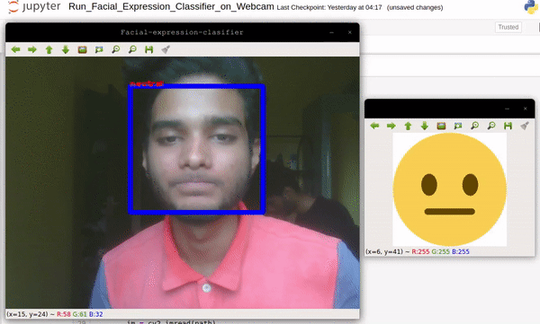

# Facial_Expression_Classifier

## Real-time classification from webcam feed:

## Classifying still images:

### How does it work?
* This uses OpenCV’s Haar cascades to detect and extract the facial region from an image or the webcam frame.

* Then this image is passed through the trained CNN, which returns a tensor corresponding to the predicted class.

### Resources used:
* [FER_2013_Dataset](https://www.kaggle.com/c/challenges-in-representation-learning-facial-expression-recognition-challenge/data)
* [haarcascade_frontalface_default.xml](https://github.com/opencv/opencv/blob/master/data/haarcascades/haarcascade_frontalface_default.xml)
* [Tutorial for using Haar Cascades](https://www.youtube.com/watch?v=88HdqNDQsEk)

## To Do
1. ~~Balance the dataset.~~
2. ~~Augment training data to increase overall robustness of the model.~~
3. ~~Implement the whole thing using PyTorch.~~
